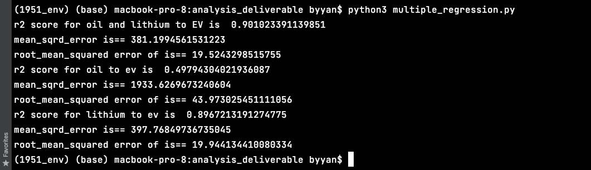

# Tech Report -- Hypothesis Testing - Bartlett's Test (Imri)
### A defined hypothesis or prediction task, with clearly stated metrics for success.
“We believe that the volatility of the closing stock price of companies directly involved with electric vehicle manufacturing included within the DRIB ETF are generally equivalent to the volatility of prices of traditional electronic tech companies.”
### Why did you use this statistical test or ML algorithm? 
The bartlett's test statistic was chosen because it gives insight into the differences between the variances of test samples. Because we are interested in understanding whether or not the volatilities of the differing stocks in the historical stock dataset are different, we felt that this measurement would be useful in coming to a conclusion. 
### Which other tests did you consider or evaluate? 
Initially, I had planned to perform an ANOVA upon the historical stock data that we had collected for the purpose of separating the observed variances between the participating stocks. An ANOVA requires that the sample data is homogenous in their variances, and that both sets are normally distributed. In order to determine whether or not the stocks of traditional tech companies within the DRIV ETF and companies directly involved with electrical vehicle manufacturing were identical in their variances, I performed the Bartlett’s test.
### How did you measure success or failure? Why that metric/value? What challenges did you face evaluating the model? Did you have to clean or restructure your data?
The test yielded the following results: P = 0.11 Test Statistic = 2.52 This test statistic is greater than the critical value, indicating that there is a significant difference between the variances of the two sample populations. The two following visualizations are QQ (quantile - quantile) Plots that illustrate the distribution of the ‘closing’ price data. The companies were grouped into either TECH or AUTO classifications, based on how directly the company is involved in the manufacturing process of vehicles. Normally distributed populations will have a qq plot that closely aligns with the line x = y. Because of this, I normalized both populations through a log transformation, the qq plots of both are posted below. In the circumstance of our hypothesis, the p value and test statistic are a reasonable measurement of success/failure of the hypothesis because they inform us about the nature of the two populations variances with repsect to one another. Because we are informed that the variances are significantly different from one another, we can conclude that our hypothesis is false. This model was relatively simple to understand; it was difficult to evaluate the difference between the variance and the distribution of the data, however, this was easily understood upon further research. This data did not require any additional cleaning or restructuring for this statistical test. If we were to go forward with the ANOVA, the normalization of their distributions would have been required. This was already done using a log transformation, however, it was not utilized in the Bartlett test.
### What is your interpretation of the results? Do accept or deny the hypothesis, or are you satisfied with your prediction accuracy? For prediction projects, we expect you to argue why you got the accuracy/success metric you have. Intuitively, how do you react to the results? Are you confident in the results?
 Because we are informed that the variances are significantly different from one another, we can conclude that our hypothesis is false. This model was relatively simple to understand; it was difficult to evaluate the difference between the variance and the distribution of the data, however, this was easily understood upon further research. This data did not require any additional cleaning or restructuring for this statistical test. If we were to go forward with the ANOVA, the normalization of their distributions would have been required. This was already done using a log transformation, however, it was not utilized in the Bartlett test. Seeing as this was not a prediction or a machine learning model, I am satisfied with the accuracy of the predictions, because we have not predicted anything here. 
### For your visualization, why did you pick this graph? What alternative ways might you communicate the result? Were there any challenges visualizing the results, if so, what where they? Will your visualization require text to provide context or is it standalone (either is fine, but it's recognize which type your visualization is)?
When I was considering performing the ANOVA, it was required that I understand the distribution of our data in order to ensure that the data is normally distributed. An ANOVA should only be performed upon data that is normally distributed. Because of this, I visualized the distributions of the stock data of two classes of companies; one grouping of companies that are direcly involved with the manufacturing of electric vehicles, and another grouping of companies that are large in electrical technology components. To do this, I greated Quantile-Quantile plots. Following normalization of both populations through a log transformation, the Quantile-Quantile plots look more similar to those of a normally distributed dataset.
### Full results + graphs (at least 1 stats/ml test and at least 1 visualization). You should push your visualizations to the /analysis_deliverable/visualizations folder in your repo. Depending on your model/test/project we would ideally like you to show us your full process so we can evaluate how you conducted the test!
In the circumstance of our hypothesis, the p value and test statistic are a reasonable measurement of success/failure of the hypothesis because they inform us about the nature of the two variances with respect to one another.

### If you did a statistics test, are there any confounding trends or variables you might be observing?
Yes, somewhat! The initial plan was to perform an ANOVA, however, there was a confounding issue. The variances of the datasets were not identical, thus preventing the ANOVA.
### If you did a machine learning model, why did you choose this machine learning technique? Does your data have any sensitive/protected attributes that could affect your machine learning model?
NA;

# Tech Report -- ML -- Multiple Linear Regression (Ray)

### A defined hypothesis or prediction task, with clearly stated metrics for success.
I want to predict the average price of EV stocks on a given day based on the same-day price of Lithium, Gold, and Oil. 
My threshold for accomplishing this goal is an R^2 value of above 0.85; in this case, I can say that the model has been developed to my level of confidence.

### Why did you use this statistical test or ML algorithm? 
I chose to use a multiple linear regression algorithm because all of our data is sequential and numerical. We aren't able to do a classification task since our prediction is not in classes; rather, we want to predict a numerical value for EV stock prices.
Further, since all of our other data is also numerical, and we can distinguish by day, we can split into many samples of data for a given day: what oil price, lithium price, and gold price make up our EV stock price?
Given this, we can find weights for each of our data points that can ultimately output a stock price!

### Which other tests did you consider or evaluate? 
I considered using a logistic regression, yet decided against it for two reasons. First, it's mostly used for classification, which we cannot do with out data.
Second, while logistic regression is powerful at finding the probability of given outcomes, I felt that linear regression was better given the sequential nature of our data, and how they can all be graphed the same way.
By this, I mean that looking at each price chart, it seems reasonable to be able to find a linear combination of these models that would result in the average EV stock price.
I also looked into polynomial regression, but decided that linear regression would be the simplest to evaluate and avoid overfitting to each price chart.

### How did you measure success or failure? Why that metric/value? What challenges did you face evaluating the model? Did you have to clean or restructure your data?
I measured the success of my model by the R^2 value of fit. This metric is a very quick way to tell if a model is fit well to data, and is given to us by statsmodels, so I chose it because it is both accurate and convenient.
The largest challenge I faced creating this model was preprocessing the data. In each of our datasets (stocks, lithium, oil, and gold), there are different dates present, and each date was formatted in a completely unique way.
First, I had to find a way to uniformly format the dates so I could compare them. I ended up doing this using a variety of lambda and map functions to clean the data into one concise date representation. Then, I sorted through all of the datasets in pandas
to keep only the data points where data is found in *all* samples. For example, 3/10/22 could be present in the oil dataset, but not in lithium, so since we don't have all of our data at this time, we must throw it out. From this process,
I was able to identify 436 unique dates where we had data for all of our metrics (stocks, oil, gold, lithium). These metrics were then organized in ascending order by date, and all the price data
was concatenated into a dataframe that contained each price for a given day (each day was a row). Finally, the data was in the correct format to train a linear regression on (oil, lithium, gold --> stocks). I also had to find a way to
normalize our stock data; with 19 stocks, which stock would we be predicting? How do we not lose information? Ultimately, I decided upon a weighted average of all stock prices on a given day (much like how an ETF price is calculated), and built a new dataframe representing this
in order to build a regression.

### What is your interpretation of the results? Do accept or deny the hypothesis, or are you satisfied with your prediction accuracy? For prediction projects, we expect you to argue why you got the accuracy/success metric you have. Intuitively, how do you react to the results? Are you confident in the results?
Ultimately, the multiple regression model (which predicts stock price from oil price, lithium price, and gold price) was quite satisfactory. Although it has a rather low R^2 at 0.875 (0.9 is generally considered stellar), it still meets my defined threshold as above 0.85. In the financial world, according to investopedia.com, an R^2 value of 0.7 represents a very high level of correlation, so by that metric, our model is way above average.
Additionally, predicting the price of any asset is a historically hard task that many are unable to recreate, so I feel that this accuracy/fit level is very good. This shows that it is at least reasonable to be able to predict EV stock prices from other 
assets. This is further shown by our relatively high f-statistic of 1005, meaning our independent variables combined were rather significant. We can see the breakdown of weights in the OLS summary: oil had a coefficient of 3, gold -0.02, and lithium -0.0004. From this, we clearly
see that Oil is the driving predictor of EV stock prices in our model, and that gold and lithium have little to no correlation with the stock prices whatsoever. Intuitively, this was surprising for me to see: 
wouldn't the components of EVs drive its price? However, looking at all the asset prices over time (first graph shown below), it makes sense. Oil and stock prices move nearly identically, while
gold and lithium have wildly different charts. It's evident that the price of electric vehicles closely follows that of oil, and gold/lithium aren't related at all yet. Since my graph and my model
agree with each other, I'm quite confident that this multiple regression model is accurate. By relying on oil prices as a signal for EV stock prices, the model is able to fairly accurately form a function to predict them, since they're so similar historically.

### For your visualization, why did you pick this graph? What alternative ways might you communicate the result? Were there any challenges visualizing the results, if so, what where they? Will your visualization require text to provide context or is it standalone (either is fine, but it's recognize which type your visualization is)?
On the X axis, we have the time, and on the Y axis, we have the price of each asset. The time period was from March 2020 to March 2022, so two years.
We selected a line graph for this because it's the best at representing time-based information; one can easily see the rises and dips of each asset's price as the line goes up or down. It would be very hard to represent this with any other graph type!
Aside from the title, we don't even need any text to show what's going on. Most are very acquainted to this type of graph, so it is quite intuitive to view.
Ultimately, the hardest thing about producing these graphs was preprocessing the data. In our SQL table, each "date" was formatted differently, so I had to write a few functions to normalize the dates and select only those that were contained in *all* datasets.
However, I believe it was worth it. We can clearly see that the average of EV stocks is highly correlated positively with the price of oil, and the prices of Lithium and Gold seem to differ widely. Thus, in our analyses, we should see that Oil and Stocks are highly correlated, whereas Stocks won't be much related to the price of Lithium or Gold.
We also see at the end of our time period, average EV stock price and oil price seem to de-couple, hinting at a phenomena that may sway their correlation in the future.

### Full results + graphs (at least 1 stats/ml test and at least 1 visualization). You should push your visualizations to the /analysis_deliverable/visualizations folder in your repo. Depending on your model/test/project we would ideally like you to show us your full process so we can evaluate how you conducted the test!
Historical price data for our four categories from March 2020 to March 2022:     
     
Multiple Linear Regression Results Summary:     
      
You can see how these graphs were generated from the code in analysis_deliverable/regression_ML!

### If you did a statistics test, are there any confounding trends or variables you might be observing?
N/A; this is an ML algorithm.

### If you did a machine learning model, why did you choose this machine learning technique? Does your data have any sensitive/protected attributes that could affect your machine learning model?
Like stated above, I chose this model because all of our data is numeric and sequential, which represents the perfect dataset for prediction
via a learned linear regression model. I don't believe my data had any sensitive/protected attributes that could have affected the model. All of our data is historical prices
for a given asset, which was all used to build the model in the first place. I don't believe any of this was out of the ordinary.

# Tech Report -- Hypothesis Testing -- Linear Regression for Oil, Lithium, and EV stocks (Brandon)

Hypothesis: 
“We believe that changes in EV stock prices over time are more affected by changes in lithium prices over time than by changes in oil prices over time.” I formulated this hypothesis because lithium and oil are both related to EV companies, but lithium is a direct input, and oil is a complement in that gas vehicles, the alternative to EV, use oil. Since lithium is a direct input, it would seem to make sense that it has more of an impact in explaining variations in EV stock prices.

I used multiple linear regression analysis because in this situation, there is one dependent variable, EV stock prices, and two independent variables, oil prices and lithium prices. I am also dealing with strictly numerical data in the form of prices, and there is also a clear distinction between independent and dependent variables here. I also considered using a chi-square test, but that wouldn’t work because chi-square is for data with counts, and the data I’m working with here has to do with numerical prices over time. I measured success by making sure I inputted the right data and received reasonable scores for r^2, mean-squared error, and root mean squared error. I used these metrics because these are the most useful and meaningful metrics for evaluating a regression. Furthermore, the biggest challenge I faced was restructuring and cleaning the data so that I could use multiple regression analysis in the first place. There was a lot of preprocessing to do, such as filtering columns and making sure dates were consistent. 
When comparing oil prices to EV stock prices, the r^2 score was 0.498. When comparing lithium prices to EV stock prices, the r^2 score was 0.897. This means that lithium prices account for a higher proportion of the variance for EV stock prices than does oil prices. In other words, changes in lithium prices affect EV stock prices more than changes in oil prices. Therefore, I accept my hypothesis, which stated that changes in EV stock prices over time are more affected by changes in lithium prices over time than by changes in oil prices over time. I received these results because in the real world, lithium should be more interconnected with EV stocks, since almost every electric vehicle uses lithium batteries, and lithium is a direct input for many, if not all, of these EV companies. Oil is less directly related, so my reaction to my results was not one of great surprise. I am confident in my results, as I made sure to perform the tests correctly, and I received reasonable results.
I did find that the results corresponded to my initial belief on the data, as explained above. I believe the tools for analysis that I chose were appropriate, because in this situation, there was one dependent variable, EV stock prices, and two independent variables, oil prices and lithium prices. I was also dealing with strictly numerical data in the form of prices, and there was also a clear distinction between independent and dependent variables. Multiple regression analysis was appropriate, and using sklearn made it easy to perform the tests and see results. The data was adequate for my analysis. The date was only needed for preprocessing and wasn’t actually used as a variable, understandably so. A possible confounding variable could be the price of electricity around the world, as more expensive electricity would probably lead people to be less likely to buy electric vehicles, and this could also affect EV stock prices.

I picked a scatter plot because it is great for showing the change of data over time involving many different data points, and I had many different data points. Scatter plots are also useful for seeing if there could be a relationship between two variables. Another way I could communicate the result is by overlaying the three scatter plots on top of each other on the same graph, but that could be hard to see because of the different scales. I had no challenges visualizing the results; it was a straightforward process. My visualizations do not require text to provide context, since all the information needed to interpret the graph is in the graph itself.

Graphs showing change in lithium prices, oil prices, and EV stock prices over time:     

Multiple Linear Regression Results Summary for Oil, Lithium, EV:     

# Tech Report -- Hypothesis Testing -- Spearman’s Coefficient With p-Value (Krishi)

### A defined hypothesis or prediction task, with clearly stated metrics for success.
We want to show that the price of Oil and Gold are not highly correlated and do not jointly affect EV stock prices. To do this, a Spearman’s coefficient p-value of above alpha = 0.05 would be enough to fail to reject the null hypothesis that the price of Oil and Gold are not highly correlated.

### Why did you use this statistical test or ML algorithm? 
The reason for this approach is that the assumption of normality among the two distributions could not be made confidently. 

### Which other tests did you consider or evaluate? 
Initially, we considered using either a  Chi-squared test or a Pearson's test to determine whether there was any correlation between oil price and gold price, however neither of these two statistical tests were appropriate for the problem at hand, first because our data was continuous not categorical, and also  because we could not determine whether the distributions of oil prices and gold prices in our given time frame were roughly normal

### How did you measure success or failure? Why that metric/value? What challenges did you face evaluating the model? Did you have to clean or restructure your data?

We measured the success of the model by determining that the p-value output did not meet our threshold which meant we were unable to reject the null hypothesis. As far as cleaning or pre processing,  we only had to change the variable type in the date column to date-time instead of string, and removing the timestamp from one column, in order to be able to join the two datasets together on their common dates in order to remove uncommon ones .

### What is your interpretation of the results? Do accept or deny the hypothesis, or are you satisfied with your prediction accuracy? For prediction projects, we expect you to argue why you got the accuracy/success metric you have. Intuitively, how do you react to the results? Are you confident in the results?
We interpret the p-value as the probability that any observed correlation is due to chance. Given the relatively high p-value along with a correlation close to zero, we feel confident in assuming that gold and oil are not correlated, thus failing to reject the null hypothesis that the price of Oil and Gold are not highly correlated and do not jointly affect EV stock prices.

### For your visualization, why did you pick this graph? What alternative ways might you communicate the result? Were there any challenges visualizing the results, if so, what where they? Will your visualization require text to provide context or is it standalone (either is fine, but it's recognize which type your visualization is)?

Time-series data is the most intuitive way to visualize the price of an asset like a stock or metal overtime (as the name suggests).  The horizontal axis of the two plots represent three month periods between March 2020 and March 2022.  The vertical axis represents the price of each asset at the corresponding dates with clear labels on each axis. A bar chart or a Dot Plot may have been used in this case, however a simple time series plot is more than enough to convey a trend given a large enough sample of data points.  Since we have close to 500 for each data set, a time-series  plot was sufficient.

### Full results + graphs (at least 1 stats/ml test and at least 1 visualization). You should push your visualizations to the /analysis_deliverable/visualizations folder in your repo. Depending on your model/test/project we would ideally like you to show us your full process so we can evaluate how you conducted the test!
Historical price data for our four categories from March 2020 to March 2022:     

 

Spearman Results Summary:     

SpearmanrResult(correlation=0.03239295731340143, pvalue=0.48031133925574565)
    
You can see how these graphs were generated from the code in analysis_deliverable/Spearman!

### If you did a statistics test, are there any confounding trends or variables you might be observing?
It could be that with the limited amount of data that we have used,  a Spearman's coefficient does not accurately capture what might be an actual relationship between the price of gold and oil over a longer period of time, which is typical to see in markets over 10 year long periods.

### If you did a machine learning model, why did you choose this machine learning technique? Does your data have any sensitive/protected attributes that could affect your machine learning model?
N/A

